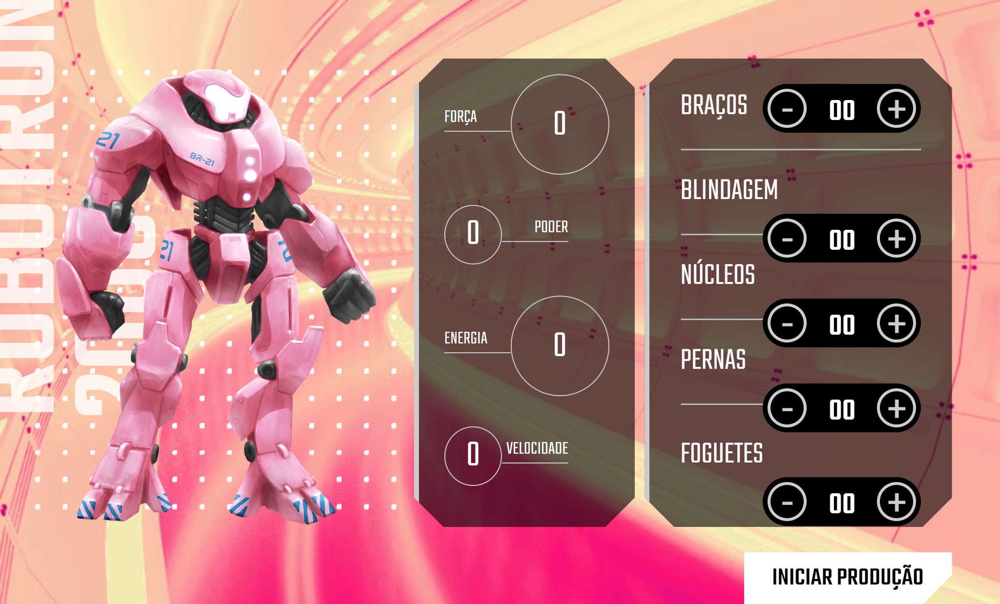

# Robotron-2000

A ideia deste projeto é que a Terra está sofrendo uma invasão alienígena e você precisa montar o seu robô para juntar as forças de defesa do planeta.
Para montar o seu Robotron  precisei adicionar peças na engrenagem que compõe um robô e ver as estatísticas atualizadas dinamicamente, tudo isso com JavaScript.
Assim cada vez que somamos, ele atualiza os valor de força, poder, energia e velocidade.
Para qualquer um das peças que escolheremos, as estatísticas são atualizadas imediatamente.

Podemos até zerar as estatísticas porque agora vem o momento do combate em nossa invasão alienígena.
<ul>
<li>Custumizei o css.</li>
<li>Interagi com HTML por meio do JavaScript.</li>
<li>Criei funções e operações lógicas.</li>
</ul>

 

