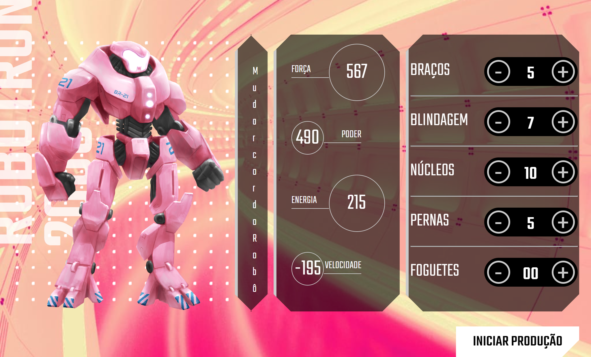

# Robotron-2000

A ideia deste projeto é que a Terra está sofrendo uma invasão alienígena e você precisa montar o seu robô para juntar as forças de defesa do planeta.
Para montar o seu Robotron  precisei adicionar peças na engrenagem que compõe um robô e ver as estatísticas atualizadas dinamicamente, tudo isso com JavaScript.
<ul>
<li>Custumizei o css.</li>
<li>Interagi com HTML por meio do JavaScript.</li>
<li>Criei funções e operações lógicas.</li>
</ul>

 

